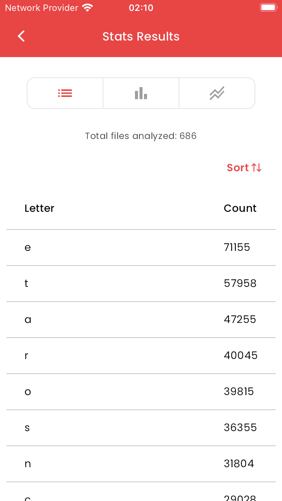
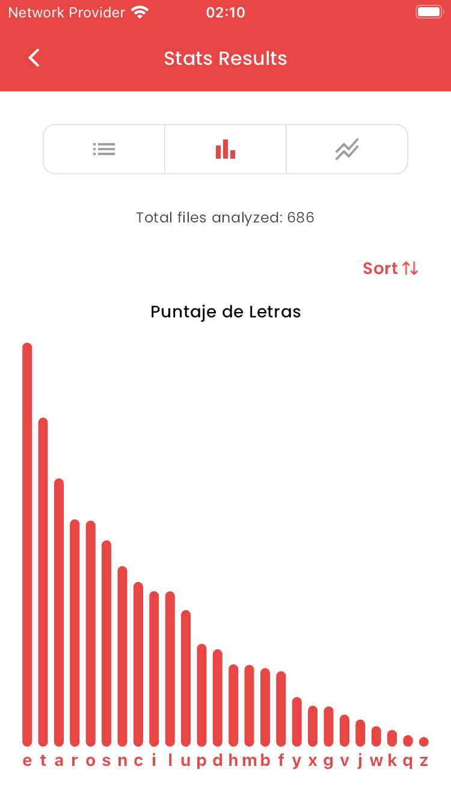
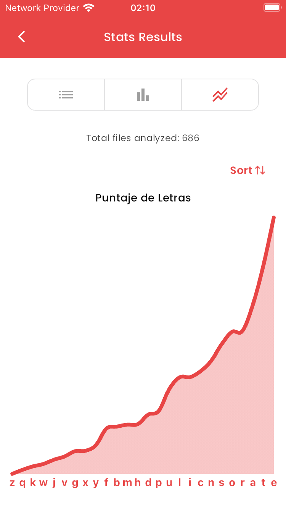

[English](README.md) | Spanish


# Github Stats App

Github Stats Mobile App desarrollada con Flutter y la API de GitHub. Realiza cálculos pesados por lotes ​​sin problemas que permiten al usuario ver un recuento completo de cada letra que aparece en cualquier repositorio público para hasta dos lenguajes de programación diferentes.

<p float="left">
  
   
  
  
  
</p>

## Instrucciones de Ejecución

Para ejecutar la aplicación:

1. Instala [Flutter](https://docs.flutter.dev/get-started/install)


2. Ejecuta `flutter gen-l10n` para generar los archivos `AppLocalizations`. ¡Actualmente ofrecemos soporte para los idiomas inglés y español!

3. Ejecuta la aplicación con `flutter run`. ¡Funciona tanto en Android como en iOS!

### Versión de Flutter

```
Doctor summary (to see all details, run flutter doctor -v):
[✓] Flutter (Channel stable, 3.19.6, on macOS 14.4.1 23E224 darwin-arm64, locale en-GB)
[✓] Android toolchain - develop for Android devices (Android SDK version 32.0.0-rc1)
[✓] Xcode - develop for iOS and macOS (Xcode 15.3)
[✓] Chrome - develop for the web
[✓] Android Studio (version 2023.2)
[✓] VS Code (version 1.88.0)
[✓] Connected device (5 available)            
[✓] Network resources
```
