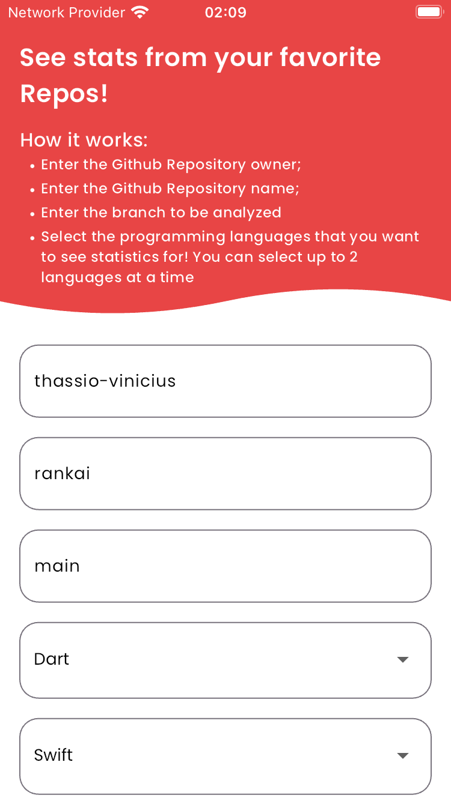
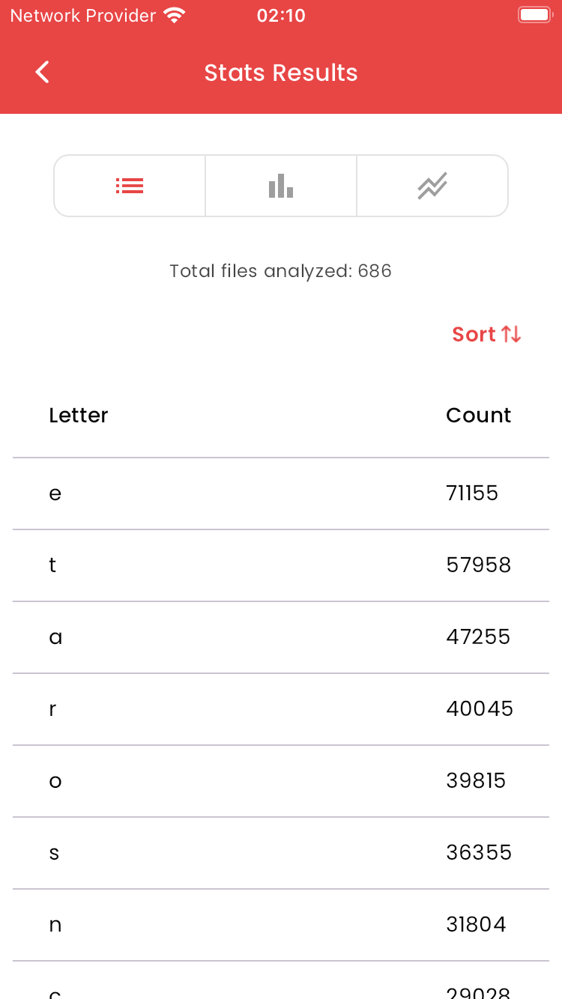
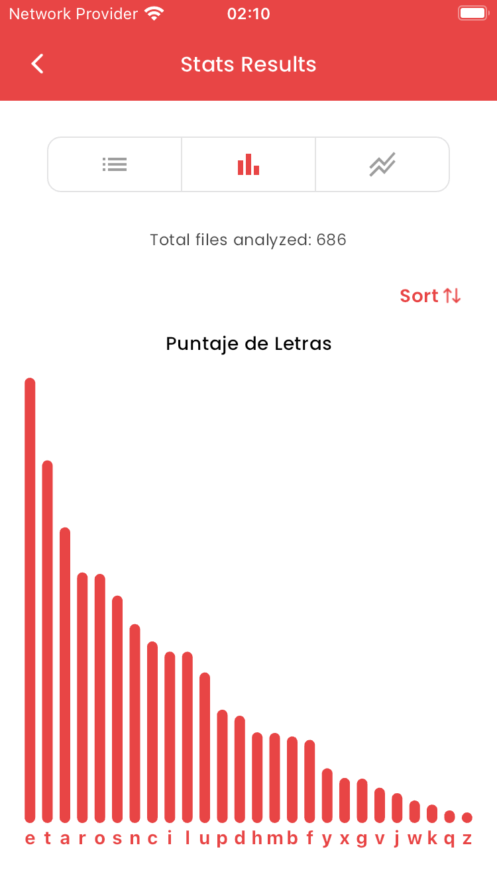
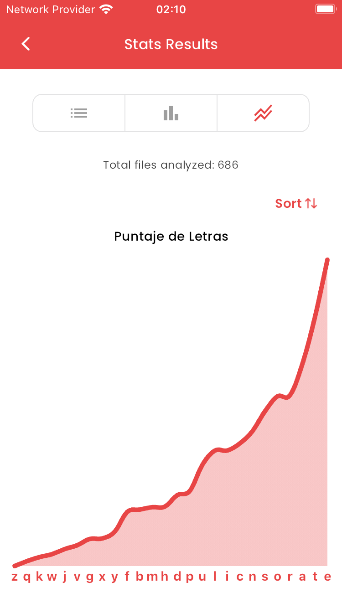

English | [Spanish](README.es.md)

# Github Stats App

Github Stats Mobile app developed with Flutter and the GitHub API. It performs heavy batched computations seamlessly that allows the user to see a full count of each letter that appears in any public repository for up to two different Programming Languages.

<p float="left">
  
   
  
  
  
</p>


## Run Instructions

To run the app:

1. Install [Flutter](https://docs.flutter.dev/get-started/install)

2. Run `flutter gen-l10n` to generate the `AppLocalizations` files. We currently support both English and Spanish languages!

3. Run the app with `flutter run`. It works on both Android and iOS!

### Flutter Version

```
Doctor summary (to see all details, run flutter doctor -v):
[✓] Flutter (Channel stable, 3.19.6, on macOS 14.4.1 23E224 darwin-arm64, locale en-GB)
[✓] Android toolchain - develop for Android devices (Android SDK version 32.0.0-rc1)
[✓] Xcode - develop for iOS and macOS (Xcode 15.3)
[✓] Chrome - develop for the web
[✓] Android Studio (version 2023.2)
[✓] VS Code (version 1.88.0)
[✓] Connected device (5 available)            
[✓] Network resources
```
